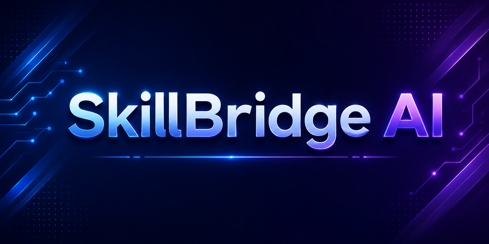
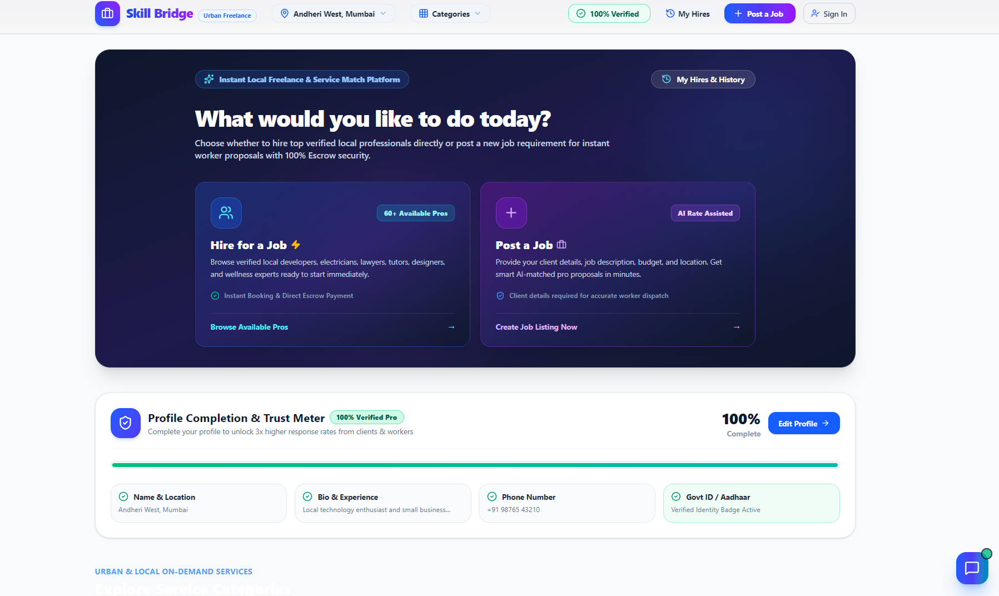
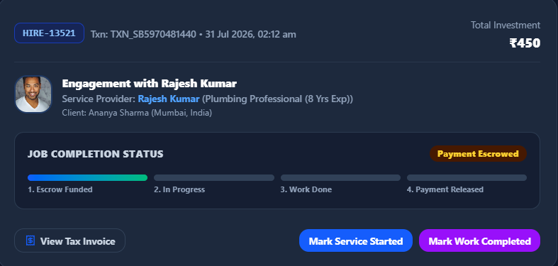
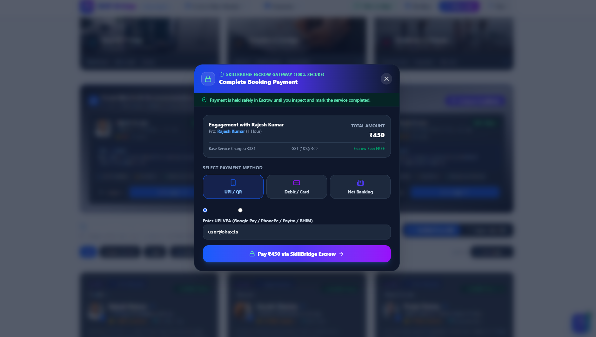
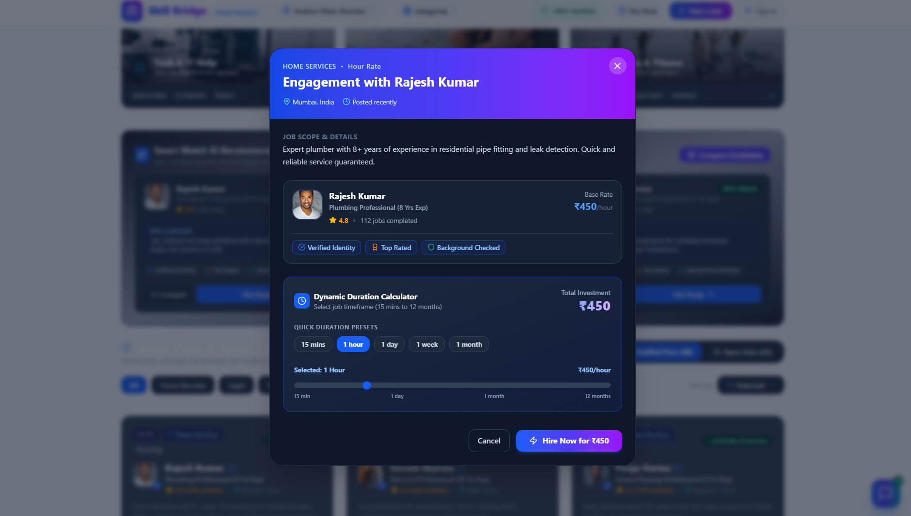
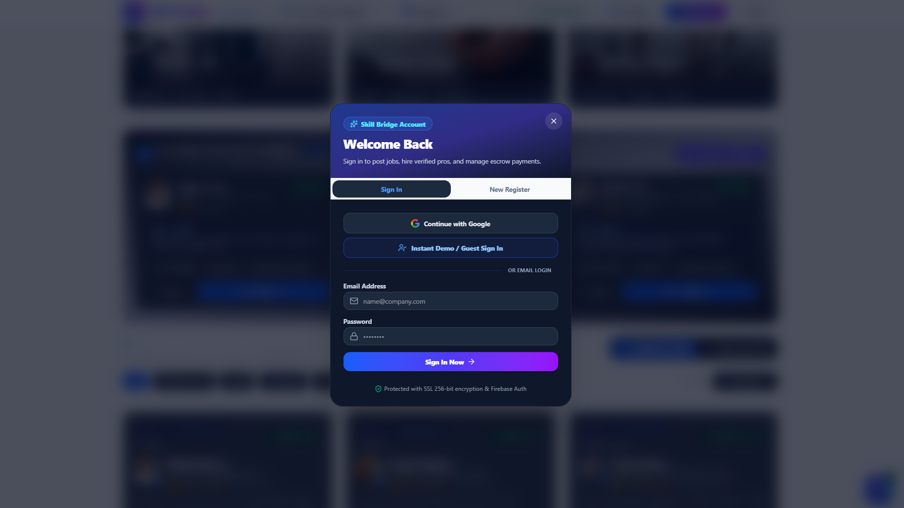
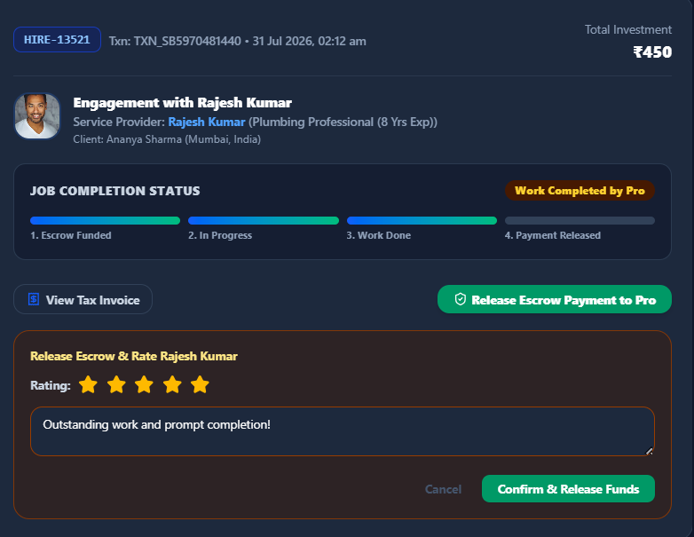

<div align="center">



# 🌉 SkillBridge AI

### *AI-Powered Freelance & Local Hiring Platform with Secure Escrow Payments*

<p>
  <a href="https://skill-bridge.pages.dev">
    
  </a>
  <a href="https://github.com/Satwik-Rajput/404squad-Satwik-Singh">
    
  </a>
</p>


</div>

---

## 🌐 Live Demo

<a href="https://skill-bridge.pages.dev">
    
</a>

</div>

# 📖 About

**SkillBridge AI** is a next-generation freelance and local service marketplace designed to connect skilled professionals with clients through **AI-powered recommendations, secure escrow payments, and intelligent pricing assistance**.

Unlike traditional freelance marketplaces, SkillBridge focuses on **instant local hiring**, allowing users to hire professionals for durations ranging from **15 minutes to several months**.

Whether someone needs a plumber, tutor, software developer, lawyer, designer, fitness coach, or electrician, SkillBridge uses **Google Gemini AI** to recommend the most suitable professionals while ensuring secure transactions through an escrow-based payment workflow.

The platform is inspired by products like **Urban Company**, **NoBroker**, and modern freelance marketplaces, while introducing AI-driven worker recommendations and transparent milestone-based hiring.

---

# 🚀 Live Demo

### 🌐 Website

https://skill-bridge.pages.dev

---

# 🎯 Problem Statement

Finding reliable professionals for short-term and long-term work remains a major challenge.

Current platforms often suffer from:

- ❌ Unverified workers
- ❌ Price uncertainty
- ❌ No intelligent worker recommendation
- ❌ Unsafe direct payments
- ❌ Lack of transparent hiring workflow
- ❌ Poor trust between clients and professionals

---

# 💡 Our Solution

SkillBridge AI solves these issues through an AI-assisted hiring ecosystem.

✔ AI Smart Match recommends the best workers.

✔ AI Rate Assistant helps estimate fair pricing.

✔ Escrow Payment protects both parties.

✔ Verified professional profiles improve trust.

✔ Dynamic duration-based pricing makes hiring flexible.

✔ Milestone tracking ensures transparency until payment release.

---

# ✨ Key Features

## 🤖 AI Features

- AI Worker Recommendation Engine
- Google Gemini Powered Rate Suggestions
- Smart Professional Matching
- Intelligent Skill-Based Search
- AI Assisted Job Posting

---

## 👨‍💼 Hiring Features

- Browse Verified Professionals
- Hire by Hour, Day, Week or Month
- Dynamic Duration Calculator
- Local Worker Discovery
- Category-wise Services
- Professional Profiles
- Ratings & Reviews
- Smart Search

---

## 💳 Secure Payment System

- Escrow Payment Gateway
- Multiple Payment Methods
- GST Calculation
- Transparent Pricing
- Payment Protection
- Secure Transaction History

---

## 🔒 Authentication

- Firebase Authentication
- Google Sign In
- Guest Login
- Secure Sessions

---

## 📊 Dashboard

- Hiring History
- Profile Completion Meter
- Trust Badge System
- Escrow Status Tracking
- Worker Ratings
- Invoice Generation

---

# 🛠 Tech Stack

| Category | Technologies |
|------------|----------------|
| Frontend | React 19, TypeScript, Vite |
| Backend | Flask |
| AI | Google Gemini API |
| Database | Firebase Firestore |
| Authentication | Firebase Authentication |
| Deployment | Cloudflare Pages |

---
---

# 📸 Application Preview

SkillBridge AI offers an end-to-end hiring experience that combines AI-powered recommendations, secure escrow payments, and an intuitive user interface. From discovering skilled professionals to completing payments and rating services, every step is designed to make hiring simple, transparent, and trustworthy.

---

## 🏠 Landing Page

<p align="center">
  
</p>

The landing page introduces users to SkillBridge AI with a modern interface showcasing featured services, trusted professionals, platform statistics, and quick navigation. It provides an engaging first impression while encouraging users to explore available services or post their own job requirements.

---

## 📊 User Dashboard

<p align="center">
  
</p>

The dashboard serves as the central workspace for users, providing quick access to active jobs, profile completion, hiring history, account management, and personalized recommendations. It ensures users can efficiently manage all their activities from a single location.

---

## 🤖 AI Smart Recommendation

<p align="center">
  
</p>

Powered by Google Gemini AI, SkillBridge intelligently recommends professionals based on skills, experience, ratings, pricing, and user requirements. This reduces search time and helps clients connect with the most suitable worker for every job.

---

## 👨‍💼 Hiring Interface

<p align="center">
  
</p>

The hiring interface allows users to review professional details, select hiring duration, calculate pricing dynamically, and confirm bookings with complete transparency before proceeding to payment.

---

## 💳 Secure Payment

<p align="center">
  
</p>

SkillBridge secures every transaction using an escrow-based payment system. Client funds remain protected until the assigned work has been successfully completed, creating trust for both clients and professionals.

---

## 👤 User Profile

<p align="center">
  
</p>

Users can manage their profile, monitor profile completion, showcase their skills, update personal information, and build credibility through ratings and completed projects, improving their visibility within the platform.

---

## 🔐 Secure Authentication

<p align="center">
  
</p>

Firebase Authentication enables secure sign-in using Google accounts and email authentication. The authentication flow is designed to provide a smooth onboarding experience while maintaining high security standards.

---

---

# 🔄 Hiring Workflow

SkillBridge AI follows a secure, transparent, and user-friendly hiring process. Every job progresses through a series of well-defined stages, ensuring both the client and the professional are protected by an escrow-based payment system until the work is successfully completed.

<br>

<div align="center">

| Step | Preview |
|:---:|:---:|
| **1️⃣ Hire a Professional** |  |
| **2️⃣ Payment Secured in Escrow** |  |
| **3️⃣ Job Status Tracking** |  |
| **4️⃣ Work Successfully Completed** |  |
| **5️⃣ Rate & Review the Professional** |  |

</div>

---

### 📌 Step 1 — Hire a Professional

The client selects a verified professional, chooses the service duration, reviews the estimated cost, and confirms the booking through a simple and intuitive hiring interface.

➡️ **Hiring → Duration Selection → Booking Confirmation**

---

### 💳 Step 2 — Secure Escrow Payment

Instead of paying the professional directly, the payment is safely stored in an escrow account. This protects both the client and the worker until the agreed work has been completed.

➡️ **Payment → Escrow Created → Job Starts**

---

### 🚀 Step 3 — Live Job Tracking

Once the professional accepts the request, the client can monitor the current status of the job in real time. The dashboard clearly indicates whether the work is pending, in progress, or awaiting confirmation.

➡️ **Accepted → In Progress → Awaiting Completion**

---

### ✅ Step 4 — Job Completion

After finishing the assigned task, the professional marks the work as completed. The client reviews the completed service before approving the final payment release.

➡️ **Worker Marks Complete → Client Verification**

---

### ⭐ Step 5 — Rating & Review

Once the client confirms successful completion, the escrow payment is released automatically. The client can then provide a rating and review, helping maintain trust and improving future AI recommendations.

➡️ **Escrow Released → Rating Submitted → Trust Score Updated**

---

<div align="center">

### 🔒 Secure • 🤖 AI Powered • ⭐ Transparent • 💳 Escrow Protected

</div>

# 🏗️ Project Architecture

SkillBridge AI follows a modular full-stack architecture that separates the frontend, backend, AI services, and cloud infrastructure to ensure scalability and maintainability.

```text
                    ┌─────────────────────┐
                    │      Client UI      │
                    │   React + Vite TS   │
                    └──────────┬──────────┘
                               │
                               ▼
                    Firebase Authentication
                               │
                               ▼
                    ┌─────────────────────┐
                    │    Flask Backend    │
                    │   RESTful APIs      │
                    └──────────┬──────────┘
                               │
         ┌─────────────────────┼─────────────────────┐
         ▼                     ▼                     ▼
 Firebase Firestore     Google Gemini AI      Escrow Payments
      Database          Smart Recommendation    Payment Flow
```

---

# 📂 Project Structure

```text
SkillBridge-AI
│
├── images/                     # README screenshots
│
├── src/
│   ├── ai-development/         # AI recommendation components
│   ├── backend/                # Backend API integration
│   ├── components/             # Reusable UI components
│   ├── data/                   # Static data
│   ├── find-work/              # Worker discovery pages
│   ├── frontend/               # Main application pages
│   ├── job-input/              # Job posting module
│   ├── lib/                    # Utility functions
│   ├── App.tsx
│   ├── main.tsx
│   └── types.ts
│
├── static/
│   ├── css/
│   ├── js/
│   └── data/
│
├── app.py                      # Flask backend
├── firebase.config.json
├── firebase-schema.json
├── requirements.txt
├── package-lock.json
└── README.md
```

---

# ⚙️ Installation

## Clone Repository

```bash
git clone https://github.com/Satwik-Rajput/404squad-Satwik-Singh.git
```

```bash
cd 404squad-Satwik-Singh
```

---

## Install Frontend Dependencies

```bash
npm install
```

---

## Start Frontend

```bash
npm run dev
```

---

## Backend Setup

```bash
pip install -r requirements.txt
```

Run the Flask server

```bash
python app.py
```

---

# 🔥 Firebase Configuration

Create a `.env` file in the project root.

```env
VITE_FIREBASE_API_KEY=YOUR_API_KEY
VITE_FIREBASE_AUTH_DOMAIN=YOUR_AUTH_DOMAIN
VITE_FIREBASE_PROJECT_ID=YOUR_PROJECT_ID
VITE_FIREBASE_STORAGE_BUCKET=YOUR_STORAGE_BUCKET
VITE_FIREBASE_MESSAGING_SENDER_ID=YOUR_SENDER_ID
VITE_FIREBASE_APP_ID=YOUR_APP_ID
```

---

# 🤖 AI Features

SkillBridge AI integrates **Google Gemini AI** to enhance the hiring experience through intelligent automation.

### AI Capabilities

- 🤖 Smart Professional Recommendation
- 💰 AI Price Suggestion
- 🎯 Skill Matching
- 📊 Experience Analysis
- ⭐ Rating-Based Ranking
- 🔍 Intelligent Worker Discovery

---

# 💳 Escrow Payment System

Instead of transferring money directly to the professional, SkillBridge secures payments using an escrow workflow.

```
Client
   │
   ▼
Escrow Payment
   │
   ▼
Professional Starts Work
   │
   ▼
Job Completed
   │
   ▼
Client Verification
   │
   ▼
Payment Released
```

This workflow increases trust between both parties while minimizing payment disputes.

---

# 🚀 Future Scope

- 📱 Android & iOS Mobile Application
- 🌍 Multi-language Support
- 💬 Real-time Chat
- 📞 Voice & Video Calling
- 📍 Live GPS Tracking
- 🤖 AI Resume Builder
- 📄 Digital Contracts
- 🧾 GST Invoice Generation
- 💼 Business Dashboard
- 📈 AI Market Demand Prediction

---

# 👨‍💻 Team

<table>
<tr>
<td align="center" width="25%">

### 👨‍💻 Satyam Singh

**UI/UX Designer**

- Designed user interface
- Created user experience flow
- Responsive layouts
- Component styling
- Visual consistency

</td>

<td align="center" width="25%">

### 👨‍💻 Satwik Singh

**API and Integartion**

- React Frontend
- Flask Backend
- Firebase Integration
- API Development
- Project Architecture

</td>
</tr>

<tr>
<td align="center">

### 👨‍💻 Kumar Aayush

**AI & Backend Developer**

- Google Gemini AI
- Smart Recommendation Engine
- AI Integration
- Backend Logic
- Database Management

</td>

<td align="center">

### 👨‍💻 Kunal Bohra

**Frontend Developer & Testing**

- UI Components
- Feature Integration
- Testing
- Bug Fixing
- Performance Optimization

</td>
</tr>

</table>

---

# 🏆 Project Highlights

- 🤖 AI-Powered Hiring Platform
- 🔒 Secure Firebase Authentication
- 💳 Escrow Payment Workflow
- ⭐ Professional Rating System
- 📊 Smart Dashboard
- ⚡ Responsive React Application
- 🚀 Google Gemini AI Integration
- 🔥 Firebase Firestore Database
- 🎯 Dynamic Pricing
- 🌐 Cloud Deployment

---

# 📄 License

This project was developed for educational and hackathon purposes.

Feel free to explore, learn from, and build upon the project.

---

<div align="center">

## ⭐ If you like this project, don't forget to star the repository!

### Made with ❤️ by Team SkillBridge AI

**Building the future of local hiring through AI.**

</div>
